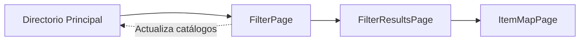

# 🏥 Módulo Directorio - Análisis Técnico

> **Módulo principal del sistema GNP Médicos**  
> Proporciona acceso al directorio médico con filtros avanzados y visualización en mapa.

## 📋 Información General

- **Tipo**: Módulo principal (página inicial)
- **Ruta**: `/directorio-medico`
- **Patrón**: GetX con arquitectura responsive
- **Estado**: Completamente funcional
- **Fecha de análisis**: 10 de noviembre de 2025

## 🏗️ Estructura del Módulo

```
📁 directorio/
├── 📄 directorio_page.dart                 # ⭐ Página principal responsive
├── 📄 directorio_controller.dart           # 🧠 Lógica de negocio y estado
├── 📄 directorio_bindings.dart             # 🔗 Inyección de dependencias
├── 📄 directorio_middleware.dart           # 🛡️ Middleware (vacío actualmente)
├── 📄 directorio_model.dart                # 📊 Modelo de datos interno
│
├── 📁 children/                            # 🧒 Módulos hijos
│   ├── 📁 filter_page/                     # 🔍 Página de filtros
│   ├── 📁 filter_results/                  # 📋 Resultados filtrados
│   └── 📁 item_map/                        # 🗺️ Vista de mapa
│
├── 📁 domain/                              # 🏛️ Capa de dominio
│   ├── 📁 entities/                        # 📦 Entidades
│   │   └── items_directory_mdl.dart
│   └── 📁 repository/                      # 🗃️ Repositorios
│       └── directory_repository.dart
│
├── 📁 responsive/                          # 📱 Vistas responsive
│   ├── 📄 directorio_phone_page.dart       # Móvil (principal)
│   ├── 📄 directorio_tablet_page.dart      # Tablet (placeholder)
│   └── 📄 directorio_desktop_page.dart     # Desktop (placeholder)
│
└── 📁 widgets/                             # 🧩 Widgets específicos
    ├── wdgt_item_menu_directory.dart
    └── item_directory_page.dart
```

## ⚡ Funcionalidades Principales

### 🎯 DirectorioPage (Página Principal)
- **Patrón**: `GetResponsiveView<DirectorioController>`
- **Binding**: Automático con `_DirectorioBindings()`
- **Middleware**: `_DirectorioMiddleware()` (actualmente vacío)
- **Responsive**: Soporte completo para phone/tablet/desktop

### 🧠 DirectorioController
- **Hereda**: `GetxController with StateMixin<_DirectorioModel>`
- **Estados**: Loading → Success/Error
- **Gestión**: 6 catálogos médicos + 4 items del directorio
- **Inicialización**: Carga automática de estados

## 📊 Items del Directorio

El módulo maneja 4 tipos principales de servicios médicos:

```dart
final List<ItemDirectoryMdl> items = [
  {
    title: 'Médicos',
    subtitle: 'Médicos en convenio',
    idPage: 'medicos',
    img: 'assets/dir_doctores.png'
  },
  {
    title: 'Hospitales', 
    subtitle: 'Hospitales en convenio',
    idPage: 'hospitales',
    img: 'assets/dir_hospitales.png'
  },
  {
    title: 'Clínicas',
    subtitle: 'Clínicas en convenio', 
    idPage: 'clinicas',
    img: 'assets/dir_clinicas.png'
  },
  {
    title: 'Otros servicios de salud',
    subtitle: 'Otros servicios de salud en convenio',
    idPage: 'otros_servicios', 
    img: 'assets/dir_otrosServiciosSalud.png'
  }
];
```

## 🗃️ Gestión de Catálogos

### 📋 6 Tipos de Catálogos Médicos

| Catálogo | Descripción | Estado Inicial |
|----------|-------------|----------------|
| `catEspecialidades` | Especialidades médicas | Vacío |
| `catCirculos` | Círculos médicos | Vacío |
| `catEstados` | Estados de la República | Carga inicial |
| `catPlanHospitalario` | Planes hospitalarios | Vacío |
| `catClinicas` | Clínicas disponibles | Vacío |
| `catOtrosServicios` | Otros servicios médicos | Vacío |

### 🔄 Flujo de Catálogos
1. **Inicialización**: Solo `catEstados` se carga automáticamente
2. **Navegación**: Los catálogos se pasan como argumentos a FilterPage
3. **Actualización**: Al regresar de FilterPage, los catálogos se actualizan

## 🔄 Flujo de Navegación



### 🎯 Argumentos de Navegación
```dart
arguments: {
  'item': ItemDirectoryMdl,
  'catEspecialidades': List<Map<String, dynamic>>,
  'catCirculos': List<Map<String, dynamic>>,
  'catPlanHospitalario': List<Map<String, dynamic>>,
  'catClinicas': List<Map<String, dynamic>>,
  'catOtrosServicios': List<Map<String, dynamic>>,
  'catEstados': List<Map<String, dynamic>>
}
```

## 📱 Vista Principal (Phone)

### 🎨 Componentes UI

#### AppBar
- **Widget**: `AppBarPhone`
- **Título**: `esMessages.mx.directory.value` ("Directorio")

#### Banner
- **Widget**: `BannerMedico`
- **Datos**: Nombre completo y código de filiación del médico

#### Lista de Items
- **Container**: `ListView.builder` con altura del 80% de pantalla
- **Items**: 4 elementos del directorio médico
- **Widget**: `ItemsMenuDirectory` (Card con imagen y título)

### 🔧 Estados de la Vista

| Estado | Widget | Descripción |
|--------|--------|-------------|
| **Loading** | `LoadingGnp()` | Spinner centrado |
| **Success** | Vista principal | Lista completa funcional |
| **Empty** | `LoadingGnp` con ícono warning | Sin información |
| **Error** | `LoadingGnp` con ícono error | Error de carga |

## 🗃️ Repositorio (DirectoryRepository)

### ⚙️ Configuración
```dart
class DirectoryRepository extends ApiBaseProvider {
  @override
  final String url = AppConfig.urlDirectorio;
  
  @override 
  final String contextPath = '/integracion/catalogo';
}
```

### 🌐 Endpoints

#### fetchEstados()
- **Método**: GET
- **URL**: `/estados`
- **Headers**: 
  - `Content-Type: application/json`
  - `apiKey: l7xxea7d6e3359234e548aac02166bca4b4b`
- **Response**: `List<EstadoMdl>`
- **Ejemplo**:
```json
[
  {
    "claveEstado": "01",
    "estado": "AGUASCALIENTES"
  },
  {
    "claveEstado": "02", 
    "estado": "BAJA CALIFORNIA"
  }
]
```

## 🧩 Widgets Específicos

### ItemsMenuDirectory

#### 📋 Propósito
Widget tipo Card que muestra imagen y título horizontal para elementos del directorio.

#### 🔧 Propiedades
```dart
const ItemsMenuDirectory({
  required this.img,      // Ruta de imagen
  required this.title,    // Título a mostrar  
  required this.jwt,      // Token de autenticación
  super.key,
});
```

#### 🎨 Diseño
- **Layout**: Horizontal (imagen izquierda, título derecha)
- **Container**: Card con padding de 10px
- **Dimensiones**: 95px altura, responsive width
- **Responsive**: `context.scale(330)` para ancho

#### ⚠️ Nota Técnica
El parámetro `img` se recibe correctamente pero actualmente no se utiliza en el widget `ImageFromWeb`. El `imageName` está hardcodeado como string vacío.

## 🎯 Módulos Hijos

### 🔍 FilterPage
- **Ruta**: `/filter-page`
- **Función**: Filtros avanzados por tipo de servicio médico
- **Controller**: `FilterPageController` con gestión compleja
- **Features**:
  - Búsqueda con autocomplete
  - Dropdowns de filtrado
  - Detección de teclado
  - Validaciones de formulario

### 📋 FilterResultsPage  
- **Ruta**: `/filter-results-page`
- **Función**: Muestra resultados filtrados
- **Tipos soportados**: Médicos, Hospitales, Clínicas, Otros servicios
- **Features**:
  - Lista paginada de resultados
  - Navegación a vista de mapa
  - Información de contacto

### 🗺️ ItemMapPage
- **Ruta**: `/item-map-page`  
- **Función**: Vista de mapa con Google Maps
- **Features**:
  - Marcadores de ubicación
  - Navegación GPS
  - Información detallada del item

## 🔧 Aspectos Técnicos

### ✅ Fortalezas

- **Arquitectura sólida**: GetX con separación clara de responsabilidades
- **Responsive design**: Soporte completo para múltiples dispositivos
- **Gestión de estado**: StateMixin para loading/success/error
- **Navegación robusta**: Paso de argumentos y actualización de catálogos
- **Manejo de errores**: Implementado con mensajes específicos
- **Documentación**: Widgets bien documentados
- **Inyección de dependencias**: Bindings correctamente configurados
- **Autenticación**: JWT integrado para servicios

### ⚠️ Áreas de Mejora

- **Responsive limitado**: Tablet y Desktop son placeholders
- **Middleware vacío**: Sin funcionalidad implementada
- **Widget bug**: Parámetro `img` no se utiliza en `ItemsMenuDirectory`
- **Testing**: Sin tests unitarios específicos del módulo
- **Catálogos**: 5 de 6 catálogos sin carga inicial

### 🎯 Oportunidades de Desarrollo

1. **Implementar vistas tablet/desktop** con layouts optimizados
2. **Agregar funcionalidad al middleware** (autenticación, logging, etc.)
3. **Corregir uso del parámetro `img`** en ItemsMenuDirectory
4. **Implementar carga inicial** para todos los catálogos
5. **Desarrollar suite de tests** completa del módulo

## 🧪 Estado de Testing

### 📊 Cobertura Actual
- **Tests unitarios**: ❌ Sin implementar
- **Tests de widgets**: ❌ Sin implementar  
- **Tests de integración**: ❌ Sin implementar
- **Tests E2E**: ❌ Sin implementar

### 🎯 Testing Recomendado

#### Unit Tests
```dart
// directorio_controller_test.dart
- ✅ onInit() carga estados correctamente
- ✅ Gestión de catálogos
- ✅ Navegación con argumentos
- ✅ Manejo de errores de API
```

#### Widget Tests  
```dart
// directorio_page_test.dart
- ✅ Renderizado de items del directorio
- ✅ Estados loading/success/error
- ✅ Navegación al tap
- ✅ Banner con datos de usuario
```

#### Integration Tests
```dart
// directorio_integration_test.dart
- ✅ Flujo completo directorio → filtros → resultados
- ✅ Actualización de catálogos
- ✅ Persistencia de datos entre navegaciones
```

## 📚 Dependencias Principales

```yaml
# Gestión de estado y navegación
get: 4.7.2

# UI y responsive
flutter: sdk

# Network y HTTP  
http: 1.5.0

# Mapas
google_maps_flutter: ^2.14.0

# Cache de imágenes
cached_network_image: 3.4.1

# Internacionalización
intl: 0.20.2
```

## 🔍 Puntos de Entrada

### Configuración en app_navigation.dart
```dart
static final List<GetPage> pages = [
  DirectorioPage.page,  // Registrado en navegación global
  FilterPage.page,      // Módulo hijo
  FilterResultsPage.page, // Módulo hijo  
  ItemMapPage.page,     // Módulo hijo
  // ...
];
```

### Configuración inicial en app.dart
```dart
// Página inicial de la aplicación
initialRoute: DirectorioPage.page.name,
```

---

## 📞 Contacto y Soporte

**Proyecto**: GNP Médicos  
**Owner**: ARoSistemas  
**Repositorio**: gnp_medicos  
**Branch**: main

---

*Este documento fue generado automáticamente el 10 de noviembre de 2025*